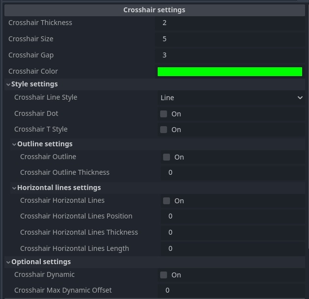

# Customizable Crosshair

This addon provides a dynamically customizable crosshair that tries to mimic the crosshair customization seen in Counter Strike and can be easily implemented into any game.

## Features

**Crosshair settings**
- Thickness
- Size (length of the lines)
- Gap (distance between the middle of the screen and the starts of the lines)
- Color
- Dot in the middle of the screen
- Dynamic crosshair movement based on customizable inputs
- Crosshair outline with thickness adjustment
- T-style configuration (removes the top line)
- Extra horizontal lines
- Different crosshair line styles

## Usage

Adding the crosshair to your game is simple and can be done with two easy steps. 

- First you want to create an instance of the crosshair scene in your player's HUD.
- Lastly you want to set the `Anchor Preset` under `Layout` to `Center` on the instance of the crosshair scene.

After these steps are performed the crosshair can be customized within the editor.

*Note that the crosshair will not be visible inside of the editor unless the `@tool` at the top of the script is uncommented. To update the looks of the crosshair inside of the editor, simply toggle the visibility of the crosshair scene.*

Updating the crosshair's looks can be done with the help of `updateCrosshair()`. An example of how this could be used is included in the demo scene.

### Dynamic crosshair

The static offset of the crosshair can be adjusted with `updateStaticOffset()`.

As for the dynamic offset, that can be updated with `updateDynamicOffset()`. This function expects a value in the range of 0 to 1.

An example of how to use both of these functions can be seen in the demo scene.
